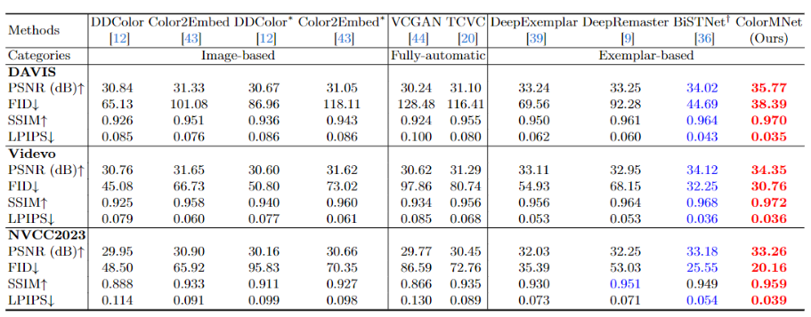
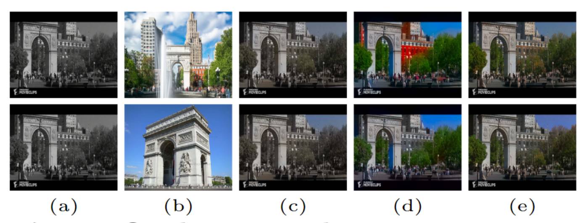
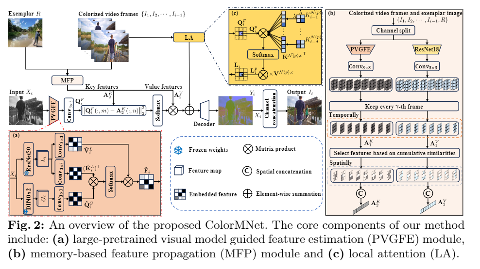

Spiegazione Paper Colormnet
Paper del 2024

## I SLIDE INTRODUZIONE AL PROBLEMA

Il task di colorare video in bianco e nero e' diventato negli ultimi anni molto importante poiche' tutti i film e video in bianco e nero registrati all'inizio del 900 non 
possono sfruttare appieno le caratteristiche dei nuovi monitor e poi per una persona comune (tranne l'appassionato) risulta meno accattivante un video in bianco e nero 

## II SLIDE ANALISI DELLA LETTERATURA

Questo task e' molto complesso, si potrebbe pensare semplicemente di usare una AI che fa image colorization e usarla per ogni frame ma questo ci da' risultati pessimi con 
nessuna coerenza di colore fra i vari frame 

il task e' ill posed e viene affrontato in diversi modi:

- user-guided image colorization
    primi approcci usando il machine learning usavano dei local hints dati dall'utente per colorare (ad esempio, dei tratti di colore che l'utente
    disegna su alcune aree dell'immagine per indicare il colore desiderato.) 
    limitazioni:
    - Generalmente, non riescono a risolvere i problemi di coerenza temporale (i colori potrebbero variare in modo irrealistico tra fotogrammi successivi).
    - Le performance di colorizzazione per i singoli fotogrammi sono spesso insoddisfacenti, poiché stimare le caratteristiche globali (dell'intera immagine) e semantiche 
        (relative al significato degli oggetti) è difficile con questo approccio.

- automatic video-colorization:
    usano il deep learning per risolvere il problema della video colorization in maniera automatica (senza hints esterni)
    - propagazione di features unidirezionale: vengono usate reti ricorrenti per propagare features ai frame successivi (unidirezionale, si guarda solo il passato)
    - propagazione bidirezionale: si hanno avuto risultati migliori avendo una propagazione bidirezionale in cui una parte della rete processa i fotogrammi 
        del video dal primo all'ultimo (propagazione in avanti) e un'altra parte della rete processa dall'ultimo al primo (propagazione indietro)

    limitazioni:
        - anche se la propagazione migliora la temporal consistency comunque stimare le features spaziali di ogni frame rimane un compito complesso a causa 
            della complessita' intrinseca delle scene nei video
        - questi metodi spesso performano bene per dataset sintetici ma mancano di generalita' se applicati a scenari del mondo reale diversificati

- exemplar-based video colorization:
    mirano a generare video partendo da un esempio in maniera tale da migliorare la temporal consistency

    - stack di frame lungo la direzione temporale: lavori su piu' frame contemporaneamente, richiede una grande memoria GPU, e' lento in inferenza
                                                    (in base a quanto tempo vuoi considerare) e poi non sfrutti le informazioni di frame adiacenti (non sfrutti l'ordine dei frame)
    - propagazione di features basato su reti ricorrenti: fa fatica a mantenere il contesto per lungo tempo (a sfruttare informazioni temporali molto distanti fra di loro)

Un altro aspetto cruciale è l' estrazione di buone caratteristiche (features) da ogni frame. 
I metodi esistenti spesso utilizzano reti neurali pre-allenate come VGG o ResNet-101. Queste reti sono efficaci nel modellare strutture locali, 
ma meno nello sfruttare strutture non locali e semantiche, come ad esempio scene complesse con molti oggetti. 
È quindi importante sviluppare un buon FEATURES EXTRACTOR che possa catturare meglio queste proprietà non locali e semantiche di ciascun frame.

## III SLIDE APPROCCIO PAPER IN BREVE
per affrontare il problema il paper sviluppa una memory-based deep spatial-temporal feature propagation network per colorizzazione di video chiamata ColorMNet
il goal e' di sviluppare una rete che colori video in bianco e nero in maniera efficiente e efficace con bassa memoria GPU richiesta

- capendo l'importanza delle features spaziali per prima cosa hanno sviluppato un modulo chiamato PVGFE (large-Pretrained Visual model Guided Feature Estimation)
    modello pretrained su larga scala (su un grande dataset) che 
    quindi grazie a questo (grande dataset) riesca a cogliere strutture non locali e la semantica (tipo e' quella in foto e' una penna)

- per superare i problemi legati a reti ricorrenti e stack di frame in seguito viene proposto un modulo MFP (memory-based feature propagation)
    che serve a esplorare e propagare in modo adattivo le features utili da frame distanti tra loro, riducendo al contempo il consumo di memoria.

- Gli autori osservano che i frame adiacenti di un video di solito contengono contenuti simili. 
    Sulla base di questa osservazione, hanno sviluppato un modulo LA (local attention) per utilizzare meglio le caratteristiche spaziali e temporali dei frame vicini.

mettendo tutti assieme questi componenti hanno creato una rete trainable end-to-end chiamata ColorMNet

## IV SLIDE PVGFE MODULE 
L'obiettivo principale del PVGFE è estrarre features spaziali robuste da ogni fotogramma in scala di grigi ($X_i$) del video. Per farlo, sfrutta le capacità di modelli visuali pre-allenati su larga scala, che sono bravi a modellare informazioni non locali e semantiche e sono robusti in diverse situazioni. L'idea è di combinare i punti di forza di due diversi tipi di modelli pre-allenati: DINOv2 (basato su Vision Transformer) e ResNet50.

Il modulo prende in input i fotogrammi del video in scala di grigi: $\{X_i\}_{i=1}^{N}$ dove $X_i$ è un singolo fotogramma di dimensioni H×W×1.
Ogni fotogramma $X_i$ viene processo da due reti DINov2 che e' un ViT small con patch size 14x14 (ViT-S/14) e ResNet50 fino a stage-4 con stride 16
il ViT genera $G_i$ e ResNet50 genera $L_i$ poi questi due vengono fusi assieme col meccanismo della cross attention e quindi prima vengono generate le key, query e value usando delle conv 3x3

$$
Q_i^G = \mathrm{Conv}_{3 \times 3}(G_i), \\
K_i^L = \mathrm{Conv}_{3 \times 3}(L_i), \\
V_i^L = \mathrm{Conv}_{3 \times 3}(L_i),
$$

e poi si crea l'attention matrix 
$A_i$ = $Q_i^G$ $(K_i^L)^T$

e fai il meccanismo dell'attenzione ottenendo $F_i$ in cui le informazioni da DINOv2 guidano la selezione e la ponderazione delle informazioni da ResNet50

$\hat{\mathbf{F}}_i = \text{softmax}\left(\frac{\hat{\mathbf{Q}}_i^G (\hat{\mathbf{K}}_i^L)^\top}{\alpha}\right) \hat{\mathbf{V}}_i^L$

${\alpha}$ e' un fattore di scala

## IV SLIDE MFP MODULE 

Il modulo MFP è progettato per colorare i video in modo efficace ed efficiente, ispirandosi ai meccanismi con cui il cervello umano memorizza informazioni a lungo termine, ovvero prestando maggiore attenzione alle informazioni usate più di frequente. L'obiettivo principale è esplorare le features temporali (cioè come cambiano le cose nel tempo nel video) stabilendo connessioni affidabili con le features di fotogrammi molto distanti nel tempo e, contemporaneamente, riducendo l'impatto di features stimate in modo impreciso.

Input Iniziali: 

Il sistema assume di aver già processato $i-1$ fotogrammi ottenendo i canali di crominanza $Y_1, ..., Y_{i-1}$, ricordiamo che $X_1, ..., X_{i}$ sono i nostri input in scala di grigio

per prima cosa estraiamo {$F_1, ..., F_i$} da {$X_1, ..., X_i$} e $F_r$ da $X_r$ che appartiene a un esempio R usando PVGFE e {$E_1, ..., E_{i-1}$} da {$Y_1, ..., Y_{i-1}$} e $E_r$ da $Y_r$ usando una ResNet18, noi vogliamo calcolare $Y_i$

e poi estraiamo query, key e value 

$$
Q^F_i = \text{Conv}_{3 \times 3}(F_i),
$$

$$
\left\{ K^F_j \right\}_{j=1}^{i-1} = \left\{ \text{Conv}_{3 \times 3}(F_j) \right\}_{j=1}^{i-1},
$$

$$
K^F_r = \text{Conv}_{3 \times 3}(F_r),
$$

$$
\left\{ V^E_j \right\}_{j=1}^{i-1} = \left\{ \text{Conv}_{3 \times 3}(E_j) \right\}_{j=1}^{i-1},
$$

$$
V^E_r = \text{Conv}_{3 \times 3}(E_r).
$$

in particolare $Q^F_i$ e' la query feature del canale di crominanza del frame corrente
$K^F_j$ e $V^E_j$ sono key e value features dei canali di crominanza e luminanza dei frame precendenti j

Memorizzare tutte le "key" e "value" features di tutti i fotogrammi precedenti consumerebbe troppa memoria GPU.

Per ovviare a ciò, si adotta una strategia: si conservano le features solo di un fotogramma ogni γ fotogrammi, scartando quelli intermedi che sono spesso ridondanti.

le key features vengono concatenate per ottenere delle key features aggregate 

$A^K_1 = Concat(K^F_γ, K^F_2γ, ..., K^F_zγ)$ 
con $ z =
\left\lfloor \frac{i - 1}{\gamma} \right\rfloor
$

data una certa soglia (numero di frame) $N_s$

caso z < $N_s$: 

l'output di MFP e' 

$A^K_2 = Concat(K^F_r, A^K_1)$ 

col tempo pero' anche $A^K_1$ diventa troppo grande (z = $N_s$) e puo' creare problemi alla memoria e quindi bisogna comprimere $A^K_1$, comprimiamo i primi $N_e$ frame e quindi z ridiventa $z = N_s - N_e$ e quindi si ritorna al caso z < $N_s$ e cosi' via fino a quando si ritorna al caso $z = N_s$

caso z = $N_s$: 

calcoliamo le similarita' {$S_γ, S_2γ, ..., S_zγ$} a partire da {K^F_γ, K^F_2γ, ..., K^F_zγ} dove $S_γ$ rappresenta quanto $K^F_γ$ somiglia a tutte le key features da γ + 1 a i - 1 usando la distanza euclidea, $S_γ$ sarebbe quanto le features di $K^F_γ$ sono riutilizzate nei K successivi, se un $K^F_γ$ e' molto simile ai successivi allora avra' valori alti di similarita' quindi sara' considerato utile e mantenuto (per mantenere la coerenza temporale)

poi le similarita' vengono normalizzate

$
S'_{\gamma} = \frac{S_{\gamma}}{i-1-\gamma}
$

poi consideriamo 

$K^c = Concat(K^F_γ, ..., K^F_Neγ)$

che sarebbe il vettore dei vari $K^F_γ$ fino a Ne

e poi calcoliamo 

$T_M(\mathbf{K}^c)$

che prende gli M key K associati a valori di similarita' piu' alta

infine 

$A^K_2 = Concat (T_M(\mathbf{K}^c), K^F_r, K^F_{(Ne + 1)γ}, ..., K^F_zγ)$

stesso procedimento si fa per i Value per ottenere prima $A^V_1$ e poi $A^V_2$

## V SLIDE DOPO MFP
per sfruttare al meglio l'informazione temporale di $A^K_2$ e $A^V_2$ usiamo la similarita' L2 calcolando la distanza in norma 2 per trovare le features $A^K_2$ piu' simili a $Q^F_i$
calcoliamo la distanza per ogni coppia di pixel (m,n)

$\mathbf{D}^i_{m,n} = \|\mathbf{Q}_i^F(:,m) - \mathbf{A}_2^K(:,n)\|_2^2$

dove:
$Q^F_i(:,m)$ sarebbe il vettore canali della feature m corrente delle query
$A^K_2(:,n)$ sarebbe il vettore della feature n in tutti i frame passati

Idea:
Immagina $Q^F_i(:,m)$ come il "contesto" del pixel (piu' in generale della feature considerata adesso) da colorare adesso.
Vuoi trovare, nei frame precedenti $A^K_2$ i pixel più simili (le feature) a questo usando le distanze $D^i$

piu' $D^i$ e' bassa e' piu' sono simili i pixel per calcolare la attention matrix ($W^i$) ovvero i pesi dell'attenzione dobbiamo usare la softmax ma la softmax funziona meglio se valori grandi significano piu' importanza (il contrario del nostro caso) e quindi mettiamo il meno

$W^i = softmax(-D^i)$

e poi facciamo il meccanismo dell'attenzione

$V_i = A^V_2 (W_i)^T$

dove $V_i$ e' una stima della crominanza (ovvero dei canali di colore) per il frame corrente i che vogliamo colorare

per migliorare questa stima e sfruttare l'informazione che frame vicini hanno contenuti simili usiamo il local attention module

## VI SLIDE LA

MFP e' servito a sfruttare informazioni temporali molto distanti, ora con LA sfruttiamo pure quelle di frame adiacenti quindi informazioni temporali molto vicine

consideriamo la Query $Q^p_i$ che sarebbe la feature del pixel p nel frame corrente i

per ogni pixel p vengono considerati i key e value vettori feature nelle patch centrate su p nei frame precedenti fino a d frame (da i indietro fino a d, non vogliamo considerare tutto il passato ma solo fino a d poiche' e' una local attention)

$K^{N(p),c} = Concat(K^{N(p)}_{i-d}, ..., K^{N(p)}_{i-1})$
$V^{N(p),c} = Concat(V^{N(p)}_{i-d}, ..., V^{N(p)}_{i-1})$

dove N(p) e' una patch di dimensione λxλ centrata in p 
dal punto di vista temporale consideriamo solo le key e value da i-d a i-1 quindi non quelle piu' lontane nel passato di d

infine calcoliamo la Local Attention

$\mathbf{L}_i^p = \text{softmax}\left( \frac{\mathbf{Q}_i^p(\mathbf{K}^{N(p),c})^\mathsf{T}}{\beta} \right) \mathbf{V}^{N(p),c}$

## VII SLIDE OUTPUT

infine usiamo un decoder con ResBlock per ottenere $Y_i$

$Y_i = D(V_i + L_i)$

## VIII SLIDE TRAINING
e' stato fatto il training usando il dataset DAVIS e Videvo e sono stati generati i video in bianco e nero con OpenCV, 
il modello e' stato trainato su una RTX A6000 GPU con 48 GB, e' stato usato Adam come optimizer, batch size settato a 4, learning rate $2x10^{-5}$, γ = 5, Ne = 5, Ns = 10, M = 128 come loss hanno usato la MAE fra le immagini predette e le ground truth

## QUANTITATIVE RESULT

per il testing sono stati usati 3 dataset di test di benchmark: DAVIS validation test, Videvo validation test e NTIRE 2023 Video Colorization Challenge validation test
per le metriche per le analisi quanitative sono state considerate la PSNR, FID, SSIM, LPIPS, il bold rosso inidica il migliore e il bold blu indica il secondo migliore, come si puo' vedere ColorMNet ha vinto in quasi tutti i casi considerati

## QUALITATIVE RESULT

e' interessare notare come in un video che rappresenta l'ambiente reale in questo caso il video rappresenta Manhattan nel 1979 si ha (a) l'Input Frame, (b) immagine di esempio presa da Google Image Search, (c)-(e) sono colorization results da parte di DeepRemaster e DeepExemplar e (e) ColorMNet, (c)-(e) non colorano nel modo appropriato il muro del palazzo, gli alberi e il cielo invece ColorMNet presenta una colorazione molto realistica

## ... SLIDE DESIGN
